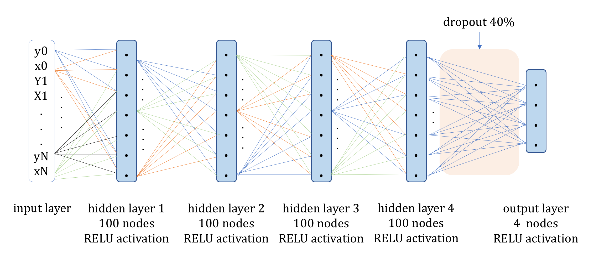
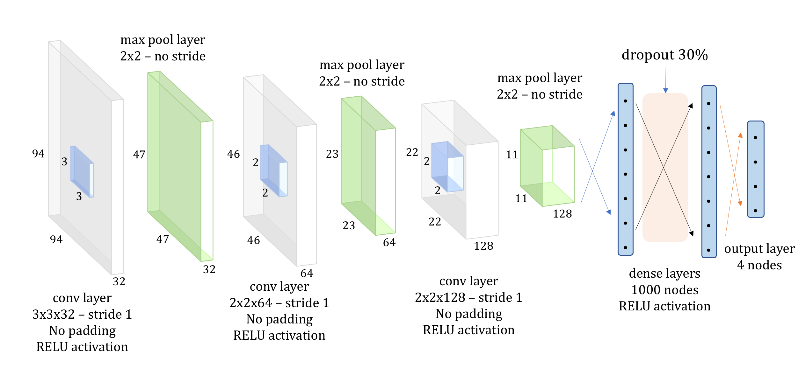

# TDSI project - Challenge on ultrasound image analysis #

A `Python 3` project for the analysis of 2D cardiac ultrasound images through the development of deep learning networks. The proposed framework is built on several libraries :
- Keras (Tensorflow as backend)
- Scikit-learn & scikit-image
- Numpy & SciPy
- Pandas
- Matplotlib & Seaborn
- SimpleITK
& others built-in packages (full list in _requirements.txt_).

The project is developed by :

* Vincent Marois <vincent.marois@protonmail.com>

### How do I get set up? ###

First, clone the repository :

    git clone git@github.com:vmarois/tdsi-challenge-deep-echo.git

Install the required python packages:

    sudo cd tdsi-challenge-deep-echo && pip3 install -r requirements.txt

You are invited to have a look at the  `read-med-files.py` script. This script shows how to use some of the most used methods defined in the local module **deepecho**.  You can execute this command to run this script :

    python3 read-med-files.py
    

The project is  divided in 3 scripts :
* `data.py` which processes the raw data to produce 2 files, *images.npy* & *targets.npy*. These 2 files contain respectively the input images for the neural network (resized to 96 x 96 or 128 x 128), and the target features we want to predict, e.g. the center coordinates (x,y) and the main orientation (normalized coordinates of the eigenvector of the covariance matrix associated with the largest eigenvalue).

* `trainneuralnet.py` creates, compiles & trains 2 neural network models : a Dense Neural Network (DNN) and a Convolutional Neural Network. Below are pictures showing the architecture of these neural networks :

After the networks have been trained, there are saved to `cnn_model.h5` & `dnn_model.h5` along with the metrics evolution during their training.

* `predict_visualize.py` loads back a given model from file, makes a prediction on one given image and plot the predicted center & orientation along the true center on the image. It also produces boxplots to compare the DNN & CNN on the distance between the predicted center & ground truth center, and on the difference of angle between the predicted orientation & ground truth one. It is also possible to plot the metrics evolution of a model.

### How is structured this project ? ###

We are structuring the project by creating a local `Python` module  called  **deepecho**, which contains the methods we implemented as we need them. So far, this module is structured in 3  `Python` files, and each file contains some methods relevant with the topic indicated by the  `Python` file name. Hence, in  `preprocessing.py`, you'll find methods to find the center and the main orientation of a region of interest on a given image.

This structure allows :
- For clearer and shorter main scripts,
- We are able to gather some functions by their role in the project (data acquisition, preprocessing, visualization etc)
- Code maintenance and the addition of future features are simplified.
